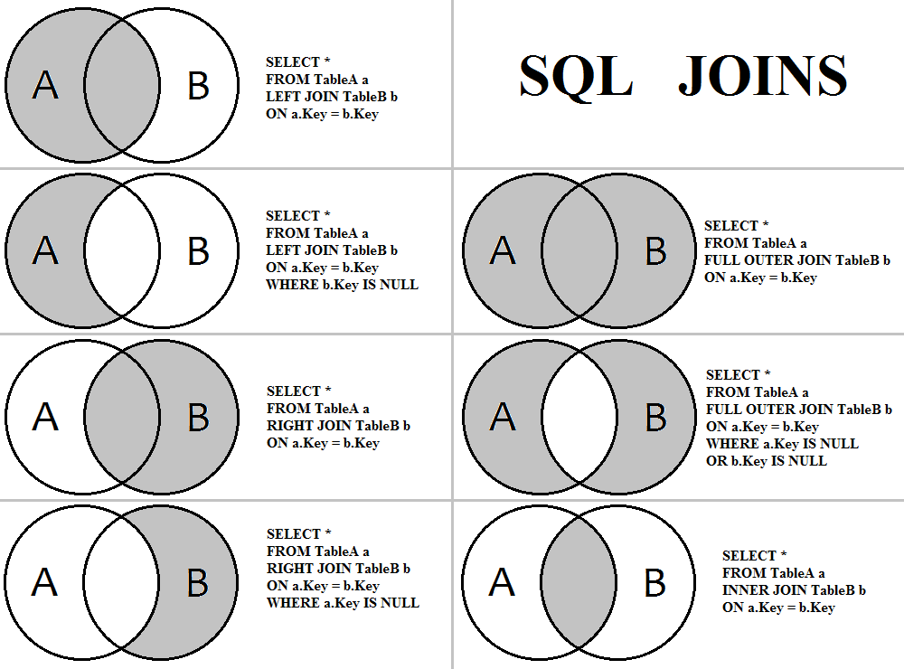
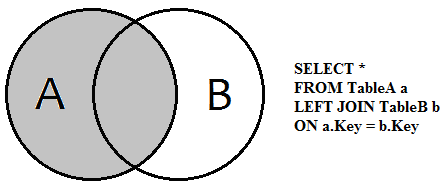
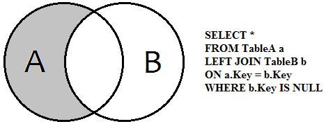
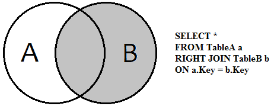
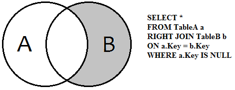
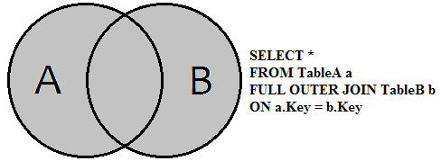
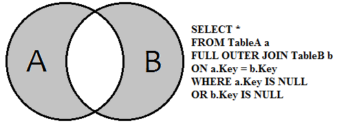
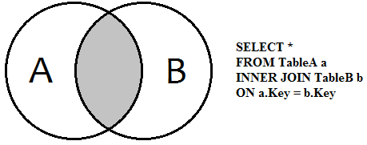

# Sql Jions



## test samples

```mysql
USE test;

DROP TABLE IF EXISTS `A`;
/*!40101 SET @saved_cs_client     = @@character_set_client */;
/*!40101 SET character_set_client = utf8 */;
CREATE TABLE `A` (
  `A1` int(11) DEFAULT NULL,
  `A2` int(11) DEFAULT NULL
) ENGINE=InnoDB DEFAULT CHARSET=latin1;
INSERT INTO `A` VALUES (1,2),(2,4),(3,6);

CREATE TABLE `B` (
  `B1` int(11) DEFAULT NULL,
  `B2` int(11) DEFAULT NULL,
  `B3` int(11) DEFAULT NULL
) ENGINE=InnoDB DEFAULT CHARSET=latin1;
INSERT INTO `B` VALUES (4,1,2),(6,7,9),(8,9,6);
```

```mysql
SELECT * FROM A;
+------+------+
| A1   | A2   |
+------+------+
|    1 |    2 |
|    2 |    4 |
|    3 |    6 |
+------+------+

SELECT * FROM B;
+------+------+------+
| B1   | B2   | B3   |
+------+------+------+
|    4 |    1 |    2 |
|    6 |    7 |    9 |
|    8 |    9 |    6 |
+------+------+------+
```

## LEFT JOIN



```mysql
SELECT * FROM A LEFT JOIN B ON A2=B3;
+------+------+------+------+------+
| A1   | A2   | B1   | B2   | B3   |
+------+------+------+------+------+
|    1 |    2 |    4 |    1 |    2 |
|    3 |    6 |    8 |    9 |    6 |
|    2 |    4 | NULL | NULL | NULL |
+------+------+------+------+------+
```


```mysql
SELECT * FROM A LEFT JOIN B ON A2=B3 WHERE B3 IS NULL;
+------+------+------+------+------+
| A1   | A2   | B1   | B2   | B3   |
+------+------+------+------+------+
|    2 |    4 | NULL | NULL | NULL |
+------+------+------+------+------+
```

## RIGHT JOIN


```mysql
SELECT * FROM A RIGHT JOIN B ON A2=B3;
+------+------+------+------+------+
| A1   | A2   | B1   | B2   | B3   |
+------+------+------+------+------+
|    1 |    2 |    4 |    1 |    2 |
|    3 |    6 |    8 |    9 |    6 |
| NULL | NULL |    6 |    7 |    9 |
+------+------+------+------+------+
```


```mysql
SELECT * FROM A RIGHT JOIN B ON A2=B3 WHERE A2 IS NULL;
+------+------+------+------+------+
| A1   | A2   | B1   | B2   | B3   |
+------+------+------+------+------+
| NULL | NULL |    6 |    7 |    9 |
+------+------+------+------+------+
```

## OUTER JOIN


```mysql
SELECT * FROM A FULL OUTER JOIN B ON A2 = B3;
```

MySQL 沒有支援full outer join，但可以使用left join & right join做到一樣的事情
```mysql
(SELECT * FROM A LEFT JOIN B ON A2 = B3) UNION (SELECT * FROM A RIGHT JOIN B ON A2 = B3);
+------+------+------+------+------+
| A1   | A2   | B1   | B2   | B3   |
+------+------+------+------+------+
|    1 |    2 |    4 |    1 |    2 |
|    3 |    6 |    8 |    9 |    6 |
|    2 |    4 | NULL | NULL | NULL |
| NULL | NULL |    6 |    7 |    9 |
+------+------+------+------+------+
```


```mysql
(SELECT * FROM A LEFT JOIN B ON A2 = B3 WHERE B3 IS NULL) UNION (SELECT * FROM A RIGHT JOIN B ON A2 = B3 WHERE A2 IS NULL);
+------+------+------+------+------+
| A1   | A2   | B1   | B2   | B3   |
+------+------+------+------+------+
|    2 |    4 | NULL | NULL | NULL |
| NULL | NULL |    6 |    7 |    9 |
+------+------+------+------+------+
```

## INNER JOIN


```mysql
SELECT * FROM A INNER JOIN B ON A2 = B3;
+------+------+------+------+------+
| A1   | A2   | B1   | B2   | B3   |
+------+------+------+------+------+
|    1 |    2 |    4 |    1 |    2 |
|    3 |    6 |    8 |    9 |    6 |
+------+------+------+------+------+
```
